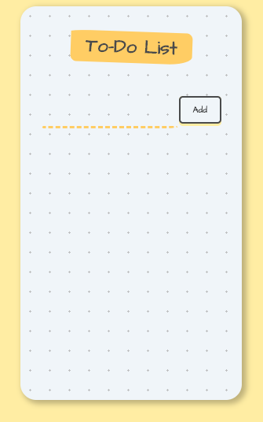
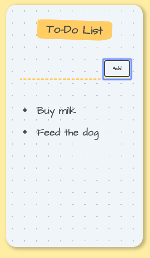

# ReactToDo
This is a simple to do list web app built using React.js using functional and stateless components.

## Screenshots
 

## Description
Simple run the web app and type in your tasks.
Click on each task to delete.

## To Run
- Clone into repo
- Run `npm i`
- Run `npm start`
